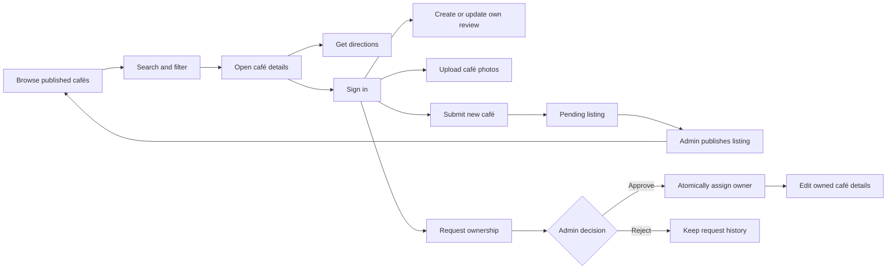
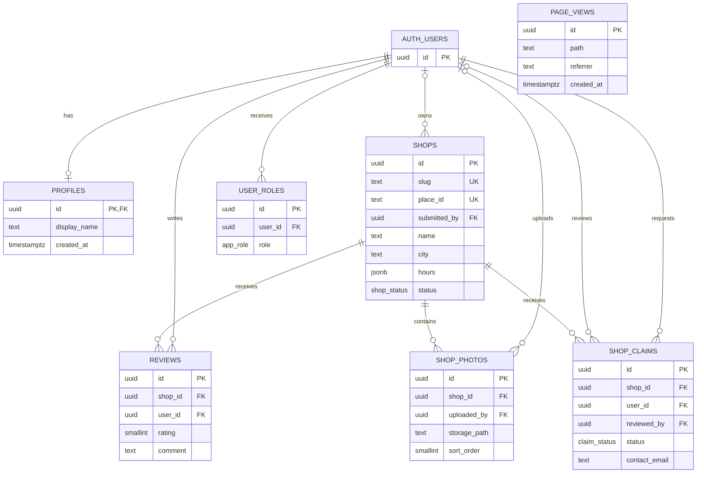
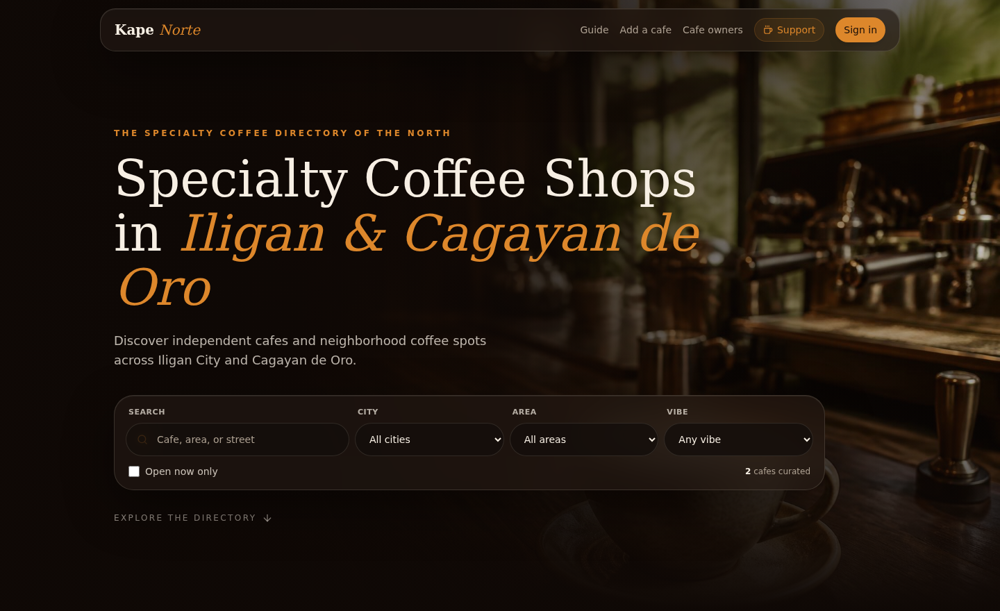
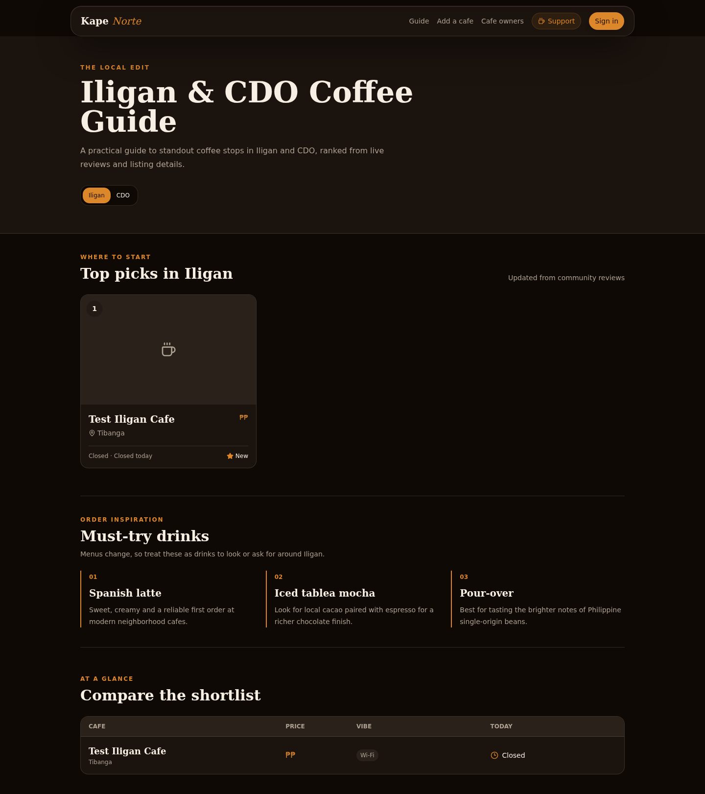

# Kape Norte

**A community coffee-shop directory for Iligan City and Cagayan de Oro, Philippines.**

Discover cafés by location, atmosphere, price, and opening hours. Read community reviews, explore an interactive map, and manage owner-submitted listings through a moderated publishing workflow.

**Stack:** React 19 · TypeScript · TanStack Start / Router / Query · Tailwind CSS 4 · Supabase · MapLibre GL · Cloudflare Workers

[Run locally](#local-development) · [Testing](#testing) · [Deployment](#cicd) · [Screenshots](#screenshots)

## Contents

<<<<<<< HEAD
- Node.js 22.12 or later
- npm (included with Node.js)
- A Supabase project
=======
- [Architecture diagram](#architecture-diagram)
- [System workflow](#system-workflow)
- [Feature list](#feature-list)
- [API documentation](#api-documentation)
- [Database schema](#database-schema)
- [AI architecture](#ai-architecture)
- [Security considerations](#security-considerations)
- [Testing](#testing)
- [Docker setup](#docker-setup)
- [CI/CD](#cicd)
- [Screenshots](#screenshots)
- [Demo](#demo)
>>>>>>> d69ab9cbac80d5d56ed414a71fab1b3a227786e9

## Architecture diagram

```mermaid
flowchart TB
    Visitor[Visitor / member / café owner / administrator]

<<<<<<< HEAD
```bash
npm ci
cp .env.example .env  # then fill in your Supabase project values
npm run dev
=======
    subgraph Browser[Browser application]
        UI[React pages and TanStack Router]
        Cache[TanStack Query cache]
        SDK[Supabase browser client]
        Map[MapLibre GL and bundled worker]
        UI --> Cache
        UI --> SDK
        UI --> Map
    end

    subgraph Worker[Cloudflare Worker]
        Start[TanStack Start SSR and server functions]
        Auth[Bearer-token validation and admin checks]
        Sync[Token-protected Places import]
        Start --> Auth
    end

    subgraph Supabase[Supabase services]
        Identity[Auth: email/password and Google OAuth]
        DB[(PostgreSQL: RLS and database RPCs)]
        Storage[Photo storage and signed URLs]
    end

    Visitor --> UI
    UI <-->|HTML and server-function RPCs| Start
    Start -->|Anonymous SSR reads| DB
    Cache -->|Direct public reads and SSR-failure recovery| SDK
    SDK --> Identity
    SDK -->|User-scoped CRUD| DB
    SDK --> Storage
    Auth --> Identity
    Auth -->|Verified-user queries| DB
    Map --> Tiles[OpenFreeMap vector maps]
    Operator[Trusted operator] -->|POST with sync token| Sync
    Sync --> Gateway[Lovable Google Maps connector]
    Gateway --> Places[Google Places]
    Sync -->|Service-role import| DB
>>>>>>> d69ab9cbac80d5d56ed414a71fab1b3a227786e9
```

### Design decisions

- **SSR with browser recovery:** public pages preload data on the server and hydrate the query cache. If the SSR host cannot reach Supabase, the browser retries directly rather than inheriting a permanent error or a fabricated empty directory.
- **Database-enforced authorization:** browser writes use the signed-in user's identity. PostgreSQL row-level security (RLS), column grants, and role-checked RPCs enforce access independently of the UI.
- **Separate map and listing providers:** OpenFreeMap supplies the basemap; Google Places is an optional listing-import source. Viewing maps does not require a Google Maps key.
- **Edge deployment:** Nitro emits the Worker bundle and static assets into `.output/server/` and `.output/public/`.

<<<<<<< HEAD
```bash
npm run dev       # Start the development server
npm run build     # Create the production Cloudflare build
npm run preview   # Preview the production build locally
npm run lint      # Run ESLint
npm run typecheck # Check TypeScript
npm test          # Unit, component, and database-policy tests
npm run test:e2e  # Browser tests (install Playwright Chromium first)
=======
### Repository layout

```text
src/
├── components/           # Map, galleries, reviews, navigation, shared UI
├── hooks/                # Session, cover-photo, clock and responsive hooks
├── integrations/
│   └── supabase/         # Clients, auth middleware and database types
├── lib/                  # Public queries, server functions and domain helpers
├── routes/               # File-based pages and HTTP route handlers
├── router.tsx            # Router and SSR query-cache integration
└── start.ts              # Server-function auth attachment and CSRF middleware
supabase/migrations/      # Tables, indexes, policies, triggers and RPCs
tests/                    # Unit, component, SQL-policy and browser tests
docs/screenshots/         # Documented sample-data UI captures
>>>>>>> d69ab9cbac80d5d56ed414a71fab1b3a227786e9
```

## System workflow



1. **Discovery:** load published listings; filter by city, area, tag, text, or “open now.” Opening status is calculated in `Asia/Manila`, including overnight schedules.
2. **Contribution:** authenticate with Supabase to write a review or upload photos. Each user has at most one review per café.
3. **Submission:** validate details and save a pending listing before uploading optional photos. A partial upload failure does not require resubmitting the café.
4. **Ownership:** submit a pending claim. Approval locks the relevant records, assigns the owner, and rejects competing pending claims for the same café.
5. **Moderation:** administrators publish pending listings and review ownership requests. Owners cannot self-publish or transfer a listing through ordinary updates.
6. **Import, optional:** a trusted operator triggers Google Places synchronization. The importer preserves existing slugs and skips owner-managed detail updates.

## Feature list

| Area           | Implemented capabilities                                                                                     |
| -------------- | ------------------------------------------------------------------------------------------------------------ |
| Directory      | Text search; city, neighborhood, and atmosphere filters; open-now filtering; price levels                    |
| Maps           | OpenFreeMap vector basemap, café pins, selection, zoom, hover/focus details, retry and external-map fallback |
| Café profiles  | Address, directions, weekly hours, photos, tags, ratings, and reviews                                        |
| Coffee guide   | City-specific shortlists, deterministic ranking, comparison cards, and curated drink suggestions             |
| Authentication | Email/password sign-in and signup; Google OAuth when configured; safe post-login destinations                |
| Reviews        | One review per user/café, ratings from 1–5, update and delete own review                                     |
| Photos         | JPG/PNG/WebP uploads up to 5 MiB, signed display URLs, own-photo deletion, orphan-upload cleanup             |
| Owner tools    | New listing submission, ownership requests, and owner-only detail/hour editing                               |
| Administration | Pending-listing publication, claim decisions, and activity statistics                                        |
| Reliability    | SSR-to-browser data recovery, bounded public requests, explicit loading/errors, and mobile navigation        |

### Page routes

| Route              | Purpose                            | Access             |
| ------------------ | ---------------------------------- | ------------------ |
| `/`                | Directory and map                  | Public             |
| `/guide`           | Coffee guide and comparison        | Public             |
| `/shops/:shopSlug` | Individual café                    | Published listings |
| `/auth`            | Member sign-in/signup              | Public             |
| `/owners`          | Owner sign-in/signup               | Public             |
| `/submit`          | Submit a café                      | Signed-in users    |
| `/owner`           | Owned listings and claims          | Signed-in users    |
| `/manage/:shopId`  | Edit a café                        | Listing owner      |
| `/claims`          | Publish listings and review claims | Administrators     |
| `/admin`           | Analytics dashboard                | Administrators     |

## API documentation

The application uses **typed query functions, TanStack Start server functions, and Supabase APIs**. It does not expose a general-purpose `/api/shops` REST API or an OpenAPI specification.

### Public query functions

Source: [`src/lib/shops.functions.ts`](src/lib/shops.functions.ts).

| Function           | Input                        | Result                                                      |
| ------------------ | ---------------------------- | ----------------------------------------------------------- |
| `listShops()`      | None                         | Published `Shop[]`, ordered by name                         |
| `listGuideShops()` | None                         | Published listings with `average_rating` and `review_count` |
| `getShopBySlug()`  | `{ data: { slug: string } }` | Published `Shop` or `null`                                  |

These functions choose an anonymous server client during SSR and the browser client during client-side navigation. All shop reads explicitly filter for published status. Requests have an eight-second timeout; network failures throw rather than masquerading as empty results.

```ts
import { getShopBySlug, listShops } from "@/lib/shops.functions";

const shops = await listShops();
const shop = await getShopBySlug({ data: { slug: "your-cafe-slug" } });
```

### Server functions

Call these through their exported functions. Their HTTP transport paths are generated by TanStack Start and are not a stable external API contract.

| Function           | Method | Input                            | Authorization / result                                        |
| ------------------ | ------ | -------------------------------- | ------------------------------------------------------------- |
| `recordPageView`   | POST   | `{ data: { path } }`             | Public; returns `{ ok: true }`                                |
| `amIAdmin`         | GET    | None                             | Valid session; returns a boolean                              |
| `listClaims`       | GET    | None                             | Admin; latest 200 claims with café details                    |
| `listPendingShops` | GET    | None                             | Admin; pending café summaries                                 |
| `decideClaim`      | POST   | `{ data: { claimId, approve } }` | Admin; UUID and boolean validated; returns `{ ok: true }`     |
| `publishShop`      | POST   | `{ data: { shopId } }`           | Admin; UUID validated; returns `{ ok: true }`                 |
| `getAdminStats`    | GET    | None                             | Admin; activity, listing, photo, claim, and signup statistics |

The global auth-attacher adds `Authorization: Bearer <access_token>` to browser server-function calls. Protected handlers validate claims before querying with the user's token. Invalid inputs, authorization failures, and database errors reject the call; callers must handle them.

See [`owner.functions.ts`](src/lib/owner.functions.ts) and [`admin.functions.ts`](src/lib/admin.functions.ts). Analytics aggregates operate on bounded queries and should not be treated as an unlimited reporting warehouse.

### Direct Supabase operations

Reviews, photo metadata, submissions, owner edits, and claim creation use the Supabase SDK directly under RLS. Photo bytes use the `shop-photos` storage bucket. The client never needs a service-role key for these operations.

### HTTP endpoint: Google Places synchronization

```http
POST /api/public/sync-places
x-sync-token: <PLACES_SYNC_TOKEN>
```

**This endpoint modifies listings.** Invoke it only from a trusted operator environment. The `public` path segment does not mean unauthenticated access is allowed. No request body is required.

Required server configuration: `SUPABASE_URL`, `SUPABASE_SERVICE_ROLE_KEY`, `PLACES_SYNC_TOKEN`, `LOVABLE_API_KEY`, and `GOOGLE_MAPS_API_KEY`. The Google integration uses the Lovable connector gateway, not an arbitrary browser Maps key.

```bash
<<<<<<< HEAD
=======
# APP_ORIGIN and PLACES_SYNC_TOKEN must already be set in your trusted shell.
curl --fail-with-body --request POST \
  "${APP_ORIGIN}/api/public/sync-places" \
  --header "x-sync-token: ${PLACES_SYNC_TOKEN}"
```

Example success response; counts are illustrative:

```json
{
  "imported": 24,
  "preservedOwnerListings": 2,
  "photos": 18
}
```

| Status | Meaning                                                                      |
| ------ | ---------------------------------------------------------------------------- |
| `200`  | Import completed; no-result responses contain `imported: 0` and a `note`     |
| `401`  | Missing, incorrect, or unconfigured sync token                               |
| `500`  | Database/configuration failure; some import steps may already have completed |
| `502`  | Initial Places lookup failed                                                 |

Successful responses are JSON; explicit error responses are generally plain text. Import and photo updates are not one transaction. The repository does not configure a scheduler for this endpoint.

## Database schema

PostgreSQL is managed by Supabase. Application tables live in `public`; identities and file objects use the managed `auth` and `storage` schemas.



### Constraints and conventions

- `shops.slug` is unique; nullable `place_id` identifies imported Google Places records.
- `reviews` has a unique `(shop_id, user_id)` pair and a database rating check of `1–5`.
- `user_roles` has a unique `(user_id, role)` pair. Roles are `admin`, `moderator`, and `user`; current administrative workflows check **admin**.
- `shop_claims` permits one pending request per `(shop_id, user_id)`. Status is `pending`, `approved`, or `rejected`.
- Listing status is `pending` or `published`. Ownership is represented by `shops.submitted_by`.
- Shop deletion cascades to reviews, photo metadata, and claims. Deleting metadata does not inherently delete the corresponding stored file.
- `handle_new_user()` creates the profile on signup; `touch_updated_at()` maintains update timestamps on relevant tables.

Opening hours use weekday keys and extended closing times:

```json
{
  "mon": ["08:00", "20:00"],
  "fri": ["16:00", "27:00"],
  "sun": null
}
```

`27:00` means 3 AM the following day. `null` means closed. Form validation normalizes overnight ranges, accepts price levels `1–4`, and rejects missing/out-of-range coordinates. These form rules are not all SQL constraints.

### Database RPCs and storage

| Function / resource                      | Responsibility                                                    |
| ---------------------------------------- | ----------------------------------------------------------------- |
| `has_role(_user_id, _role)`              | Role membership check                                             |
| `review_shop_claim(_claim_id, _approve)` | Admin-only, transactional claim decision and ownership assignment |
| `publish_shop(_shop_id)`                 | Admin-only publication of a pending listing                       |
| `shop-photos` bucket                     | Private bucket; files stored under `<user-id>/<uuid>.<extension>` |

Photo display uses signed URLs valid for one hour. A private bucket is not a confidentiality guarantee: the current storage SELECT policy allows reading objects in this bucket. Do not upload sensitive documents.

**Schema source of truth:** [`supabase/migrations/`](supabase/migrations/). TypeScript definitions: [`src/integrations/supabase/types.ts`](src/integrations/supabase/types.ts).

### Applying migrations

Use Supabase CLI migration history against the intended project, or apply only unapplied SQL through an authorized database session. Back up existing data and inspect pending changes first.

> **Migration warning:** historical migrations include seed-data cleanup that deletes reviews and non-Places listings. Do not replay migration history manually against an existing production database. The current moderation workflows require [`20260920030000_functional_fixes.sql`](supabase/migrations/20260920030000_functional_fixes.sql).

For a linked development project, inspect the plan before applying:

```bash
npx supabase login
npx supabase link --project-ref YOUR_PROJECT_REF
npx supabase db push --dry-run
# Review the plan and confirm the target project before running:
npx supabase db push
```

See [FIXES.md](FIXES.md) for the migration and authorization checklist.

## AI architecture

**There is no runtime AI/ML subsystem in this application.** No LLM calls, embeddings, vector database, RAG pipeline, model training, or AI-driven moderation are implemented. The Lovable integration is infrastructure/tooling, not an inference pipeline.

The coffee guide uses a transparent, deterministic ranking function:

```text
reviewScore = averageRating × 12 + min(reviewCount, 10) × 2
              (0 when no average rating is available)

detailScore = (Google cover photo available ? 8 : 0)
              + number of tags
              + number of days with configured opening hours

score = reviewScore + detailScore
```

Listings are filtered by city, sorted by score, and limited to six picks. Drink suggestions are curated static content. Google Places supplies listing data, not AI recommendations.

Implementation: [`src/routes/guide.tsx`](src/routes/guide.tsx). Any future AI feature would need a separate design covering consent, data minimization, evaluation, cost limits, and a non-AI fallback; it is not part of the current feature set.

## Security considerations

### Implemented controls

- **RLS and column grants:** users can edit their own reviews and permitted listing fields, not self-publish or transfer ownership.
- **Verified identity:** protected server functions validate Supabase JWT claims; administrative operations also check role membership.
- **Transactional moderation:** claim approval serializes decisions for a café and rejects already-reviewed claims.
- **CSRF protection:** TanStack Start CSRF middleware covers server-function requests. The standalone sync endpoint uses a separate shared-secret header.
- **Input handling:** Zod validates forms and administrative inputs; login destinations are restricted to local paths; map popup text is inserted as text, not interpolated HTML.
- **Upload controls:** supported image MIME types, a 5 MiB size limit, per-user storage paths, and cleanup when a metadata insert fails.
- **Secret isolation:** the service-role client is server-only and reserved for trusted imports. `VITE_*` values are public browser-build configuration.

### Deployment responsibilities and limitations

- Never commit service-role keys, sync tokens, Google connector credentials, or Cloudflare deployment tokens. `.env.example` contains placeholders; an already tracked `.env` is not protected by adding it to `.gitignore`.
- Configure Supabase Auth site/redirect URLs for your real origins. Google OAuth must be enabled separately; never grant admin access based on frontend state.
- Assign administrator roles only through a trusted database/admin session.
- Photo type checks are not malware scanning. Public profiles/reviews and the permissive storage read policy require a clear privacy policy.
- Page-view ingestion is publicly writable, and no application-level rate limiter or bot challenge is implemented. Add appropriate abuse controls before scaling writes or imports.
- Review CSP, monitoring, retention, backups, and external-provider terms. Preserve OpenStreetMap/OpenMapTiles/OpenFreeMap and Google photo attribution.

## Testing

```bash
npm ci
npm run lint
npm run typecheck
npm test
npm run build

# Install Chromium and its system dependencies once, then run browser tests.
npx playwright install --with-deps chromium
npm run test:e2e
```

| Layer           | Tooling                       | Coverage                                                                                                                     |
| --------------- | ----------------------------- | ---------------------------------------------------------------------------------------------------------------------------- |
| Domain logic    | Vitest                        | Manila time, overnight/24-hour schedules, redirects, coordinates, and form validation                                        |
| Components      | React Testing Library + jsdom | Review loading, failed writes/deletes, and form recovery                                                                     |
| Storage helpers | Vitest mocks                  | Image validation, denied deletion, and orphan-upload cleanup                                                                 |
| Database        | PGlite                        | Real migrations, grants, RLS, publication, and claim RPCs with minimal Supabase schema stubs                                 |
| Browser         | Playwright                    | Search/filtering, details/404s, sign-in recovery, submissions, owner dashboard, mobile navigation, maps, and outage recovery |

`npm run test:watch` runs Vitest interactively. `PLAYWRIGHT_CHROMIUM_EXECUTABLE_PATH` can select an existing Chromium executable.

Browser tests start an isolated app on **3100** and a synthetic backend on **4100**. Map-specific tests exercise the actual canvas and bundled worker with a deterministic style fixture. These tests do not write to production Supabase and do not prove live OAuth, external tile availability, or production deployment health. Reserve both ports before running the suite.

## Docker setup

**Current status:** no Dockerfile, Compose stack, or production container image is checked in. Production targets Cloudflare Workers, not a standalone Node server.

For optional **local development**, run the existing app inside the official Node image. Configure `.env` first using the [local setup](#local-development). This mounts your working tree, including `.env`, into a trusted local container; it does not bake credentials into an image.

```bash
docker run --rm -it \
  --name kape-norte-dev \
  --publish 3000:3000 \
  --workdir /app \
  --volume "$PWD:/app" \
  --volume kape-norte-node-modules:/app/node_modules \
  node:22-bookworm-slim \
  sh -c 'npm ci && npm run dev -- --host 0.0.0.0 --port 3000'
```

Open `http://localhost:3000`. The named volume keeps Linux dependencies separate from host `node_modules`. Supabase remains an external service; this command does not provision a database, apply migrations, or include browser-test dependencies. This is a development recipe, not a validated production Docker deployment.

## CI/CD

**Current status:** no CI workflow is committed under `.github/workflows/`, and automatic deployment is not configured in this repository.

### Recommended quality gates

| Stage                   | Commands / action                                                  |
| ----------------------- | ------------------------------------------------------------------ |
| Install                 | Node 22.12+ and `npm ci`                                           |
| Static checks           | `npm run lint` and `npm run typecheck`                             |
| Unit and database tests | `npm test`                                                         |
| Browser tests           | Install Playwright Chromium; run `npm run test:e2e`                |
| Production build        | Set the intended public build variables; run `npm run build`       |
| Release approval        | Review migration plan, environment changes, and smoke-test results |
| Deployment              | Deploy the prebuilt Cloudflare Worker using an authorized account  |

A future deployment workflow should keep Cloudflare tokens in protected environment secrets, avoid production credentials on untrusted pull requests, and separate database migration approval from ordinary application builds.

### Manual Cloudflare deployment

1. Complete the database and Auth configuration.
2. Ensure the public URL/key in `wrangler.toml` match the browser's `VITE_SUPABASE_*` values. The checked-in project references must be changed when deploying against a different Supabase project.
3. Configure optional import credentials as Worker secrets only if using Places synchronization.
4. Build and deploy:

```bash
npx wrangler login
npm ci
>>>>>>> d69ab9cbac80d5d56ed414a71fab1b3a227786e9
npm run build
npx wrangler deploy
```

Do not create a Wrangler secret with the same name as an existing `[vars]` entry. Nitro generates deployment metadata under `.output/` and `.wrangler/`; the application includes a custom SSR entry at `src/server.ts`.

After deployment, smoke-test `/`, `/guide`, a published café, authentication redirects, and an authorized owner/admin workflow. Verify map resources load from the deployment origin. See [DEPLOY-CLOUDFLARE.md](DEPLOY-CLOUDFLARE.md) and [FIXES.md](FIXES.md) for operational context.

## Screenshots

These are real UI captures from the isolated development fixtures. Café names and counts are **sample data**, not production listings. They do not demonstrate live map-provider connectivity.

### Directory and discovery controls



<details>
<summary>Coffee guide and comparison — expand screenshot</summary>



</details>

## Demo

### Local development

**Prerequisites:** Node.js **22.12+**, npm, and a Supabase project. Map rendering requires a WebGL-capable browser with access to `tiles.openfreemap.org`. Core browsing does not require Google Places credentials.

```bash
git clone https://github.com/aikanii/kape-norte-cdoiligan.git
cd kape-norte-cdoiligan
npm ci

# Preserve an existing environment file.
test -f .env || cp .env.example .env
# Edit .env with your own Supabase project values before starting.
npm run dev -- --host 0.0.0.0 --port 3000
```

Open `http://localhost:3000` after completing the database setup. A fresh project may have no published listings; submit and publish a café or explicitly configure the optional importer. No production demo accounts or shared admin passwords are provided.

### Environment variables

| Variable                        | Scope                   | Purpose                                              |
| ------------------------------- | ----------------------- | ---------------------------------------------------- |
| `VITE_SUPABASE_URL`             | Public, build time      | Browser Supabase project URL                         |
| `VITE_SUPABASE_PUBLISHABLE_KEY` | Public, build time      | Browser publishable key; not an authorization bypass |
| `SUPABASE_URL`                  | Server runtime          | Matching Supabase project URL                        |
| `SUPABASE_PUBLISHABLE_KEY`      | Server runtime          | Anonymous and user-scoped server queries             |
| `SUPABASE_SERVICE_ROLE_KEY`     | Server secret, optional | Privileged Places import; never prefix with `VITE_`  |
| `PLACES_SYNC_TOKEN`             | Server secret, optional | Authorizes the sync HTTP endpoint                    |
| `LOVABLE_API_KEY`               | Server secret, optional | Google Maps connector gateway access                 |
| `GOOGLE_MAPS_API_KEY`           | Server secret, optional | Connector connection credential used by the importer |

See [`.env.example`](.env.example). Browser values are embedded in the build; changing runtime values alone does not update an already-built client. Public SSR reads can fall back to the browser when only the server's Supabase connection is unavailable.

### Suggested walkthrough

1. Browse `/`, search for a café, and change city/atmosphere filters.
2. Open `/guide` to compare the city shortlist.
3. Open a café, inspect hours and reviews, and use the map or directions link.
4. Sign in and submit a review or a new café.
5. Visit `/owner` to manage your listings or request ownership.
6. With a separately provisioned admin account, visit `/claims` and `/admin`.

### Hosted demo

The deployment guide names **[kapenorte.dpdns.org](https://kapenorte.dpdns.org)** as the intended custom domain. Live availability and the currently deployed revision are not verified by this README. For a new deployment, use the `workers.dev` URL returned by Wrangler until your custom domain is configured.

<<<<<<< HEAD
- TanStack Start
- TypeScript
- React
- Tailwind CSS
- Supabase
- Cloudflare Workers

## Database setup and regression tests

See [FIXES.md](FIXES.md) for the required database migration, auth configuration, automated test commands, and verification limitations. Use `npm ci` and `package-lock.json` for reproducible installs.

## Map tiles

Maps use OpenFreeMap (OpenStreetMap data) rendered with MapLibre GL. No map API key is needed. The map worker is bundled locally; the browser must be able to reach `tiles.openfreemap.org`. Network or WebGL failures show a retry action and an external-map link while the café list remains usable.
=======
>>>>>>> d69ab9cbac80d5d56ed414a71fab1b3a227786e9
