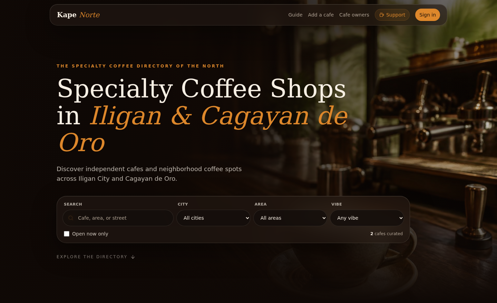
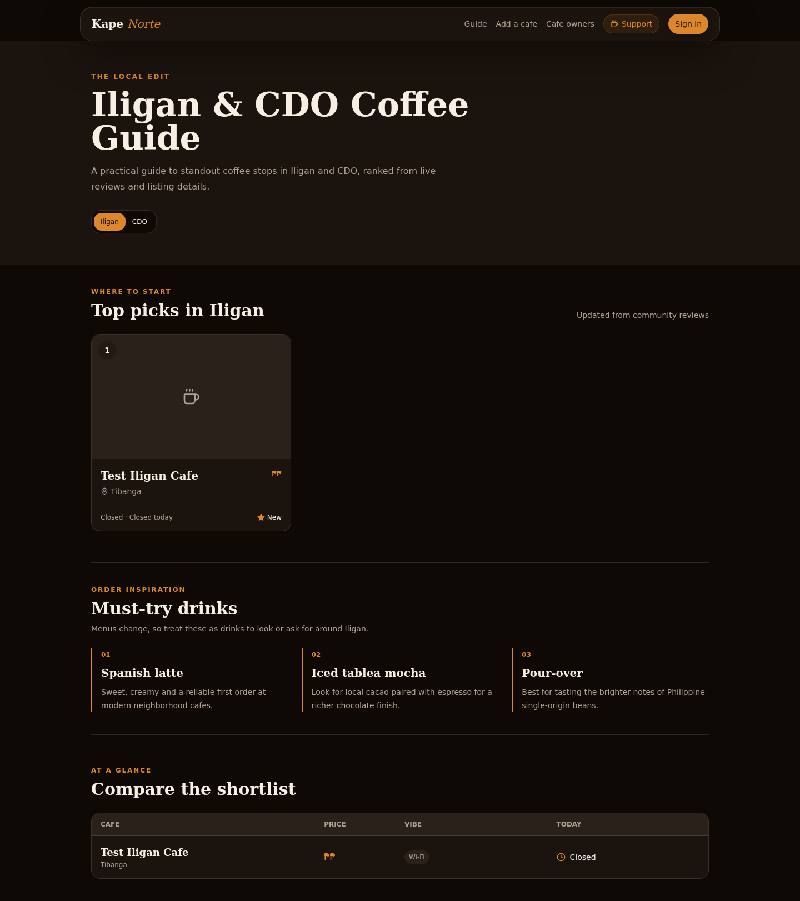
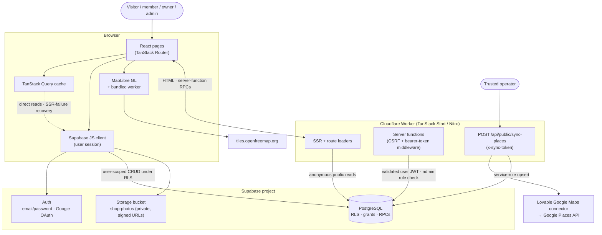
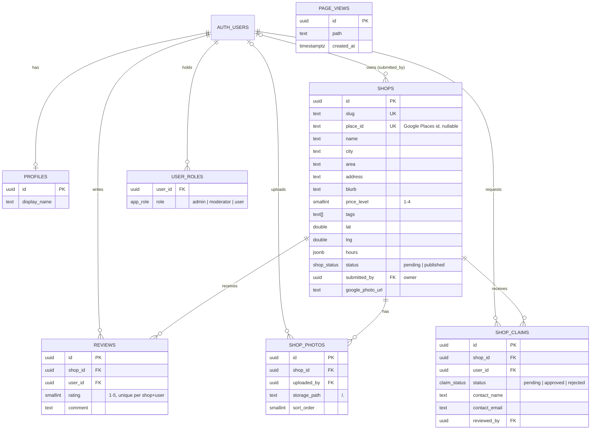

<div align="center">

# ☕ Kape Norte

**A community-maintained directory of specialty coffee shops in Iligan City and Cagayan de Oro, Northern Mindanao, Philippines.**

Browse an interactive map, see which cafés are open _right now_ in Manila time, read and write reviews, upload photos, and let café owners claim and manage their own listings through a moderated workflow.

[](https://react.dev)
[](https://www.typescriptlang.org)
[](https://tanstack.com/start)
[](https://tailwindcss.com)
[](https://supabase.com)
[](https://workers.cloudflare.com)

[Why it exists](#why-kape-norte-exists) · [Features](#features) · [Architecture](#architecture) · [Getting started](#getting-started) · [Testing](#testing) · [Deployment](#deployment) · [Contributing](#contributing)

</div>

---

## Table of contents

- [Why Kape Norte exists](#why-kape-norte-exists)
- [Features](#features)
- [Screenshots](#screenshots)
- [Tech stack](#tech-stack)
- [Architecture](#architecture)
- [Project structure](#project-structure)
- [Getting started](#getting-started)
- [Available scripts](#available-scripts)
- [Environment variables](#environment-variables)
- [Data model](#data-model)
- [Application routes](#application-routes)
- [Server functions and HTTP endpoints](#server-functions-and-http-endpoints)
- [Testing](#testing)
- [Deployment](#deployment)
- [Security model](#security-model)
- [Known limitations and roadmap](#known-limitations-and-roadmap)
- [Contributing](#contributing)
- [Acknowledgements and attribution](#acknowledgements-and-attribution)
- [License](#license)

---

## Why Kape Norte exists

Iligan City and Cagayan de Oro have a lively, fast-growing café scene, but discovering it is harder than it should be:

- **Listings are scattered.** Cafés live across map apps, social media pages, and word of mouth. There is no single, local-first place that answers _"Where can I get good coffee near Tibanga right now?"_
- **Opening hours are unreliable.** Many local cafés open in the afternoon and close well past midnight. Generic listings handle "closes at 3 AM" badly, and rarely tell you whether a shop is open _at this moment_ in Philippine time.
- **The community has no voice.** Reviews and photos from regulars get lost, and café owners have no lightweight way to keep their own details accurate without going through a large platform.

**Kape Norte** — _kape_ is Filipino/Cebuano for coffee, _norte_ points to Northern Mindanao — was built to be that place. Its design goals, all reflected in the codebase, are:

| Goal                                           | How the project delivers it                                                                                                                                                                                                                                         |
| ---------------------------------------------- | ------------------------------------------------------------------------------------------------------------------------------------------------------------------------------------------------------------------------------------------------------------------- |
| **Local-first discovery**                      | The directory is scoped to two cities. Filter by city, barangay/area, "vibe" tags, and price level. The **Open now** filter and every status label are computed in `Asia/Manila`, including overnight schedules (e.g. `16:00 → 27:00`).                             |
| **Community-maintained data**                  | Any signed-in member can review a café (one review per person per shop), upload photos, and submit a new café. Owners can claim listings and edit their details. Administrators publish pending listings and decide ownership claims.                               |
| **Trust enforced in the database, not the UI** | PostgreSQL row-level security, column-level grants, and `SECURITY DEFINER` RPCs make it impossible for an owner to self-publish, transfer a listing, or approve their own claim — regardless of what the frontend sends.                                            |
| **Cheap and independent to operate**           | The basemap uses [OpenFreeMap](https://openfreemap.org) vector tiles rendered by MapLibre GL — **no map API key required**. The app runs on Cloudflare Workers and a Supabase project. Google Places is an _optional_ bulk-import source, not a runtime dependency. |
| **Resilient by default**                       | Public pages render on the server but fall back to direct browser reads if the SSR host cannot reach Supabase. Map failures (blocked tiles, no WebGL) degrade to a **Retry** button and an external-map link instead of breaking the page.                          |

## Features

### For visitors (no account needed)

- **Directory (`/`)** – Searchable, filterable list of published cafés with cover photos, price level (`₱`–`₱₱₱₱`), tags, and a live open/closed label that refreshes every minute.
- **Interactive map** – MapLibre GL map with colour-coded pins (green = open, brown = closed), hover/focus popups with a cover photo, click-to-select syncing with the list, zoom controls, and automatic recentering per city.
- **Café pages (`/shops/:slug`)** – Address, "Get directions" link, weekly hours in 12-hour format, photo gallery, tags, average rating, and reviews. Unknown slugs return a real 404.
- **Coffee guide (`/guide`)** – A per-city shortlist of up to six cafés ranked by a transparent, deterministic score (see [ranking](#coffee-guide-ranking)), curated must-try drinks for each city, and a price/vibe/today's-hours comparison table.
- **Accessible and mobile-friendly** – Labelled controls, keyboard-focusable map pins, and a collapsible mobile menu.

### For members (email/password or Google sign-in)

- **Reviews** – Rate a café 1–5 stars with a comment (up to 1,000 characters). One review per user per café, editable and deletable.
- **Photos** – Upload JPG/PNG/WebP images up to 5 MiB to a café's gallery. Photos are served through one-hour signed URLs; uploaders can delete their own photos.
- **Submit a café (`/submit`)** – Validated form (name, city, area, address, blurb, coordinates, price level, weekly hours with overnight support, optional photos). New listings are saved as **pending** until an admin publishes them. If a photo upload fails, the café is not lost or duplicated.

### For café owners

- **Owner dashboard (`/owner`)** – See your submitted/owned listings and the status of your ownership claims.
- **Claim a listing** – Request ownership of an existing café with your contact details. One pending claim per user per café.
- **Manage a listing (`/manage/:shopId`)** – Edit name, area, address, blurb, price level, tags, coordinates, opening hours, and photos. Owners **cannot** change publication status or ownership — the database forbids it.

### For administrators

- **Review listings (`/claims`)** – Publish pending cafés and approve/reject ownership claims. Approving a claim atomically assigns the owner and rejects competing pending claims for the same café.
- **Analytics (`/admin`)** – Page views (today / 7 d / 30 d / total, 14-day chart, top pages), review counts and average rating, most-reviewed cafés, listing/photo/claim counts, and sign-ups.

### For operators

- **Google Places import (`POST /api/public/sync-places`)** – A token-protected endpoint that searches Google Places for coffee shops in both cities, upserts them as published listings, and backfills cover photos — while preserving existing slugs and never overwriting owner-managed listings.

> **Scope note.** The current codebase contains **no AI/semantic search, geolocation tracking, personalised recommendations, or push notifications**. The coffee guide's ranking is a plain arithmetic formula. See [Known limitations and roadmap](#known-limitations-and-roadmap).

## Screenshots

Captured from the isolated test fixtures, so café names and counts are **sample data**.

| Directory and search controls                                                              | Coffee guide                                                                                       |
| ------------------------------------------------------------------------------------------ | -------------------------------------------------------------------------------------------------- |
|  |  |

## Tech stack

| Layer              | Technology                                                                                                                                                                               | Notes                                                                                                  |
| ------------------ | ---------------------------------------------------------------------------------------------------------------------------------------------------------------------------------------- | ------------------------------------------------------------------------------------------------------ |
| UI                 | [React 19](https://react.dev), [Tailwind CSS 4](https://tailwindcss.com), [shadcn/ui](https://ui.shadcn.com) on [Radix UI](https://www.radix-ui.com), [lucide-react](https://lucide.dev) | Dark, editorial design system defined with `oklch` CSS variables in [`src/styles.css`](src/styles.css) |
| Framework          | [TanStack Start](https://tanstack.com/start) 1.168, [TanStack Router](https://tanstack.com/router) 1.170, [TanStack Query](https://tanstack.com/query) 5                                 | File-based routing, SSR, typed server functions, SSR query-cache hydration                             |
| Build              | [Vite 8](https://vite.dev), [Nitro 3](https://nitro.build), `@lovable.dev/vite-tanstack-config`                                                                                          | Nitro emits a Cloudflare Workers bundle in `.output/`                                                  |
| Maps               | [MapLibre GL 6](https://maplibre.org), [OpenFreeMap](https://openfreemap.org) Positron style                                                                                             | Web worker bundled and served from the same origin; no CDN scripts                                     |
| Backend            | [Supabase](https://supabase.com) — PostgreSQL, Auth, Storage                                                                                                                             | RLS, RPCs, triggers; `@supabase/supabase-js` 2.x                                                       |
| Validation & forms | [Zod](https://zod.dev) 3, [react-hook-form](https://react-hook-form.com)                                                                                                                 | Shared schemas for forms and server-function inputs                                                    |
| Hosting            | [Cloudflare Workers](https://workers.cloudflare.com) via Wrangler                                                                                                                        | Static assets binding + SSR Worker                                                                     |
| Testing            | [Vitest 5](https://vitest.dev), [Testing Library](https://testing-library.com), [PGlite](https://pglite.dev), [Playwright](https://playwright.dev)                                       | Unit, component, real-PostgreSQL policy tests, and browser E2E                                         |
| Quality            | TypeScript 5.8 (strict), ESLint 9 flat config, Prettier 3                                                                                                                                | `npm run typecheck`, `npm run lint`, `npm run format`                                                  |

The project was scaffolded from Lovable's TanStack Start template; a few integration files under `src/integrations/` are marked _auto-generated_ and should be replaced rather than hand-edited.

## Architecture


```mermaid
flowchart TB
    User([Visitor / member / owner / admin])

    subgraph Browser["Browser"]
        UI["React pages<br/>(TanStack Router)"]
        Cache["TanStack Query cache"]
        SDK["Supabase JS client<br/>(user session)"]
        Map["MapLibre GL<br/>+ bundled worker"]
        UI --> Cache
        UI --> SDK
        UI --> Map
    end

    subgraph Worker["Cloudflare Worker (TanStack Start / Nitro)"]
        SSR["SSR + route loaders"]
        Fns["Server functions<br/>(CSRF + bearer-token middleware)"]
        Sync["POST /api/public/sync-places<br/>(x-sync-token)"]
    end

    subgraph Supabase["Supabase project"]
        Auth["Auth<br/>email/password · Google OAuth"]
        DB[("PostgreSQL<br/>RLS · grants · RPCs")]
        Storage["Storage bucket<br/>shop-photos (private, signed URLs)"]
    end

    User --> UI
    UI <-->|"HTML · server-function RPCs"| SSR
    SSR -->|"anonymous public reads"| DB
    Cache -.->|"direct reads · SSR-failure recovery"| SDK
    SDK --> Auth
    SDK -->|"user-scoped CRUD under RLS"| DB
    SDK --> Storage
    Fns -->|"validated user JWT · admin role check"| DB
    Map --> Tiles["tiles.openfreemap.org"]
    Operator([Trusted operator]) --> Sync
    Sync --> Gateway["Lovable Google Maps connector<br/>→ Google Places API"]
    Sync -->|"service-role upsert"| DB
```

### How a request flows

1. **Public pages** (`/`, `/guide`, `/shops/:slug`) run a route loader that calls a typed query function ([`src/lib/shops.functions.ts`](src/lib/shops.functions.ts)). On the server it uses an anonymous Supabase client; in the browser it uses the session-aware client. Results hydrate the TanStack Query cache. If the SSR fetch fails, [`preloadPublicQuery`](src/lib/public-query.ts) discards the error instead of hydrating it, and the browser refetches directly.
2. **Authenticated pages** live under the `_authenticated` layout, are client-rendered (`ssr: false`), and redirect to `/auth?redirect=…` when no session exists. Redirect targets are restricted to same-origin paths.
3. **Member writes** (reviews, photos, submissions, owner edits, claims) go **directly from the browser to Supabase** with the user's JWT. PostgreSQL RLS is the authorization layer.
4. **Admin operations** are TanStack Start **server functions**. A global client middleware attaches the user's access token; the server middleware validates the token with `auth.getClaims()`, then the handler checks `has_role(uid, 'admin')` and calls a `SECURITY DEFINER` RPC (`publish_shop`, `review_shop_claim`) that re-checks the role inside the database.
5. **Page-view analytics** are recorded by a public server function on every route resolution and read only by admins.
6. **Bulk import** is a standalone HTTP route guarded by a shared secret header; it is the only code path that uses the service-role key, and it never ships to the client bundle.

### Key design decisions

- **Database-enforced authorization.** The browser never needs — and never receives — privileged credentials. Owners get column-level `UPDATE` grants that exclude `status` and `submitted_by`.
- **Two Supabase server clients, on purpose.** [`public.server.ts`](src/integrations/supabase/public.server.ts) (publishable key, anonymous SSR reads) and [`client.server.ts`](src/integrations/supabase/client.server.ts) (service role, import only). They are never mixed.
- **Extended closing times.** Hours are stored per weekday as `["HH:MM", "HH:MM"]` where the closing time may exceed `24:00` (`"27:00"` = 3 AM next day). [`src/lib/hours.ts`](src/lib/hours.ts) computes open state in Manila time and correctly treats "closed after midnight" as still open in the early hours.
- **Map and listing providers are decoupled.** OpenFreeMap draws the map; Google Places (optional) supplies listing data. You can run the whole app without a Google key.
- **Custom SSR entry.** [`src/server.ts`](src/server.ts) wraps the TanStack Start server entry so catastrophic SSR errors render a friendly HTML error page instead of a raw JSON 500.

## Project structure

```text
.
├── src/
│   ├── routes/                    # File-based routes (see src/routes/README.md)
│   │   ├── __root.tsx             # HTML shell, <head> meta, 404/error boundaries, page-view tracking
│   │   ├── index.tsx              # Directory + map
│   │   ├── guide.tsx              # Coffee guide and ranking
│   │   ├── shops.$shopSlug.tsx    # Café detail page
│   │   ├── auth.tsx, owners.tsx   # Member / owner sign-in and sign-up
│   │   ├── _authenticated/        # Session-guarded layout: submit, owner, manage.$shopId, claims, admin
│   │   └── api/public/sync-places.ts   # Token-protected Google Places import
│   ├── components/
│   │   ├── ShopMap.tsx            # MapLibre map with pins, popups, retry/fallback
│   │   ├── ShopGallery.tsx        # Photo gallery, upload and delete
│   │   ├── Reviews.tsx            # Review list and editor
│   │   ├── SiteHeader.tsx         # Navigation, auth state, admin links
│   │   └── ui/                    # shadcn/ui primitives
│   ├── hooks/                     # useSession, useCoverPhotos, useNow (minute ticker), use-mobile
│   ├── integrations/supabase/     # Browser client, server clients, auth middleware, generated DB types
│   ├── lib/
│   │   ├── shops.functions.ts     # Public queries (isomorphic)
│   │   ├── owner.functions.ts     # Admin server functions: claims, pending listings, publish
│   │   ├── admin.functions.ts     # Page-view recording, admin stats
│   │   ├── places.server.ts       # Google Places search/photo import (server-only)
│   │   ├── hours.ts               # Opening-hours model and Manila-time logic
│   │   ├── shop-form.ts           # Zod schema + hours normalisation for listing forms
│   │   ├── photos.ts              # Storage helpers, validation, signed URLs
│   │   ├── auth.ts                # safeRedirect, credential schemas
│   │   └── public-query.ts        # SSR-with-browser-recovery preload helper
│   ├── router.tsx                 # Router + SSR query-cache integration
│   ├── start.ts                   # Global middleware: auth attacher, CSRF, error page
│   ├── server.ts                  # Worker fetch entry wrapping TanStack Start
│   └── styles.css                 # Tailwind 4 theme and design tokens
├── supabase/
│   ├── config.toml                # Linked project id
│   └── migrations/                # Schema, RLS, grants, triggers, RPCs (source of truth)
├── tests/
│   ├── *.test.ts(x)               # Vitest: hours, photos, public-query, reviews, database (PGlite)
│   ├── e2e/                       # Playwright: app.spec.ts, map.spec.ts
│   └── fixtures/backend.mjs       # Synthetic Supabase-compatible backend for E2E
├── docs/screenshots/              # UI captures used in this README
├── public/                        # favicon, robots.txt
├── wrangler.toml                  # Cloudflare Workers configuration
├── vite.config.ts · vitest.config.ts · playwright.config.ts
├── DEPLOY-CLOUDFLARE.md           # Step-by-step deployment guide
└── FIXES.md                       # Change log of functional fixes and the pre-deploy checklist
```

## Getting started

### Prerequisites

- **Node.js 22.12+** and **npm 10+** (the repo also ships a `bun.lock`, but `package-lock.json` + `npm ci` is the reproducible path).
- A **Supabase project** (the free tier is sufficient).
- Optional: a Cloudflare account for deployment, and Chromium for the browser tests.
- A WebGL-capable browser that can reach `tiles.openfreemap.org` to render maps.

### 1. Clone and install

```bash
git clone https://github.com/aikanii/kape-norte-cdoiligan.git
cd kape-norte-cdoiligan
npm ci
```

### 2. Set up the database

Apply the migrations in [`supabase/migrations/`](supabase/migrations/) to your project with the Supabase CLI:

```bash
npx supabase login
npx supabase link --project-ref <your-project-ref>
npx supabase db push --dry-run   # review the plan
npx supabase db push
```

> **Warning for existing databases.** The migration history includes an early seed-data cleanup step that deletes reviews and non-Google-Places listings. Applying the full history to a **fresh** project is safe; never replay individual historical migrations against a database that already holds real data. The moderation features require the final migration, [`20260920030000_functional_fixes.sql`](supabase/migrations/20260920030000_functional_fixes.sql).

The migrations create all tables, enums, indexes, RLS policies, grants, triggers, RPCs, and the private `shop-photos` storage bucket.

### 3. Configure Supabase Auth

In the Supabase dashboard → **Authentication → URL Configuration**, set your site URL and add redirect URLs for your local and deployed origins (the app redirects back to paths such as `/`, `/owner`, `/submit`, and café pages). Enable the **Google** provider if you want "Continue with Google"; email/password works without it.

### 4. Create an administrator

Admin rights are granted purely through the database. From the SQL editor (or another trusted session):

```sql
insert into public.user_roles (user_id, role)
values ('<auth.users.id of your account>', 'admin');
```

Admins see **Review listings** and **Analytics** in the header.

### 5. Configure environment variables

```bash
cp .env.example .env
```

Fill in your project's URL and publishable key for both the `VITE_*` (browser, build-time) and non-prefixed (server, runtime) variables. See [Environment variables](#environment-variables).

> **Note:** a `.env` file is currently tracked in this repository even though `.gitignore` lists it. Overwrite it with your own values and take care not to commit them (`git update-index --skip-worktree .env` is one option). Never put service-role keys or sync tokens in `VITE_*` variables.

### 6. Run the app

```bash
npm run dev
```

The dev server listens on **http://localhost:8080** by default (pass `-- --port 3000` to change it). A fresh database has no published listings: sign in, submit a café at `/submit`, then publish it from `/claims` with your admin account — or run the optional [Google Places import](#google-places-import).

## Available scripts

| Script               | What it does                                                                 |
| -------------------- | ---------------------------------------------------------------------------- |
| `npm run dev`        | Start the Vite/TanStack Start dev server with HMR on port 8080               |
| `npm run build`      | Production build → `.output/server/` (Worker) and `.output/public/` (assets) |
| `npm run build:dev`  | Same build with `--mode development`                                         |
| `npm run preview`    | Preview the production build locally                                         |
| `npm run typecheck`  | `tsc --noEmit` with strict settings                                          |
| `npm run lint`       | ESLint (TypeScript, React Hooks, React Refresh, Prettier)                    |
| `npm run format`     | Prettier write across the repo                                               |
| `npm test`           | Vitest: unit, component, and PGlite database-policy tests                    |
| `npm run test:watch` | Vitest in watch mode                                                         |
| `npm run test:e2e`   | Playwright browser tests against isolated fixtures                           |

## Environment variables

| Variable                        | Scope                       | Required    | Purpose                                                          |
| ------------------------------- | --------------------------- | ----------- | ---------------------------------------------------------------- |
| `VITE_SUPABASE_URL`             | Browser (baked in at build) | Yes         | Supabase project URL                                             |
| `VITE_SUPABASE_PUBLISHABLE_KEY` | Browser (baked in at build) | Yes         | Publishable/anon key — safe to expose; RLS governs access        |
| `SUPABASE_URL`                  | Server runtime              | Yes         | Same project URL for SSR and server functions                    |
| `SUPABASE_PUBLISHABLE_KEY`      | Server runtime              | Yes         | Anonymous SSR reads and user-token validation                    |
| `SUPABASE_SERVICE_ROLE_KEY`     | Server secret               | Import only | Bypasses RLS; used **only** by the Places import route           |
| `PLACES_SYNC_TOKEN`             | Server secret               | Import only | Shared secret checked in the `x-sync-token` header               |
| `LOVABLE_API_KEY`               | Server secret               | Import only | Bearer token for the Lovable Google Maps connector gateway       |
| `GOOGLE_MAPS_API_KEY`           | Server secret               | Import only | Connection key forwarded to the gateway (`X-Connection-Api-Key`) |

Browser and server values must point at the **same** Supabase project. Because `VITE_*` values are embedded at build time, rebuild after changing them. In production the two `SUPABASE_*` runtime values are declared in [`wrangler.toml`](wrangler.toml) `[vars]`; secrets are set with `wrangler secret put`.

## Data model

All application tables live in the `public` schema; identities and files use Supabase's managed `auth` and `storage` schemas. [`supabase/migrations/`](supabase/migrations/) is the source of truth and [`src/integrations/supabase/types.ts`](src/integrations/supabase/types.ts) holds the generated TypeScript types.


```mermaid
erDiagram
    AUTH_USERS ||--o| PROFILES : "has"
    AUTH_USERS o|--o{ SHOPS : "owns (submitted_by)"
    AUTH_USERS ||--o{ REVIEWS : "writes"
    AUTH_USERS o|--o{ SHOP_PHOTOS : "uploads"
    AUTH_USERS ||--o{ USER_ROLES : "holds"
    AUTH_USERS ||--o{ SHOP_CLAIMS : "requests"
    SHOPS ||--o{ REVIEWS : "receives"
    SHOPS ||--o{ SHOP_PHOTOS : "has"
    SHOPS ||--o{ SHOP_CLAIMS : "receives"

    SHOPS {
        uuid id PK
        text slug UK
        text place_id UK "Google Places id, nullable"
        text name
        text city
        text area
        text address
        text blurb
        smallint price_level "1-4"
        text[] tags
        double lat
        double lng
        jsonb hours
        shop_status status "pending | published"
        uuid submitted_by FK "owner"
        text google_photo_url
    }
    REVIEWS {
        uuid id PK
        uuid shop_id FK
        uuid user_id FK
        smallint rating "1-5, unique per shop+user"
        text comment
    }
    SHOP_PHOTOS {
        uuid id PK
        uuid shop_id FK
        uuid uploaded_by FK
        text storage_path "<user-id>/<uuid>.<ext>"
        smallint sort_order
    }
    SHOP_CLAIMS {
        uuid id PK
        uuid shop_id FK
        uuid user_id FK
        claim_status status "pending | approved | rejected"
        text contact_name
        text contact_email
        uuid reviewed_by FK
    }
    USER_ROLES {
        uuid user_id FK
        app_role role "admin | moderator | user"
    }
    PROFILES {
        uuid id PK
        text display_name
    }
    PAGE_VIEWS {
        uuid id PK
        text path
        timestamptz created_at
    }
```

### Opening hours format

`shops.hours` is a JSON object keyed by weekday. Each value is `[open, close]` or `null` (closed). Closing times may exceed `24:00` to express overnight hours:

```json
{
}
```

`"27:00"` means 3 AM the following day; `["00:00", "24:00"]` on every day means always open. Form input is normalised by [`normalizeHours`](src/lib/shop-form.ts), which rejects invalid times and ranges longer than 24 hours.

### Permissions at a glance

| Table / resource      | Anonymous                | Member                                           | Listing owner                                                        | Admin                                      |
| --------------------- | ------------------------ | ------------------------------------------------ | -------------------------------------------------------------------- | ------------------------------------------ |
| `shops`               | read published           | read published; insert own as `pending`          | + read own; update details columns only (no `status`/`submitted_by`) | + read all; publish via `publish_shop()`   |
| `reviews`             | read                     | insert / update / delete own (1 per shop)        | —                                                                    | —                                          |
| `shop_photos`         | read for published shops | insert into own folder; update / delete own      | + read photos of own listings                                        | + read all                                 |
| `shop_claims`         | —                        | insert own `pending`; read own                   | —                                                                    | read all; decide via `review_shop_claim()` |
| `user_roles`          | —                        | read own                                         | —                                                                    | — (writes only via trusted DB session)     |
| `page_views`          | insert                   | insert                                           | —                                                                    | read                                       |
| `profiles`            | read                     | insert / update own (auto-created on sign-up)    | —                                                                    | —                                          |
| Storage `shop-photos` | read objects             | upload / update / delete within `<own-user-id>/` | —                                                                    | —                                          |

Database functions: `has_role(user_id, role)`, `publish_shop(shop_id)`, `review_shop_claim(claim_id, approve)`; triggers `handle_new_user()` (creates a profile) and `touch_updated_at()`.

## Application routes

| Route                          | Page                                                             | Access                           |
| ------------------------------ | ---------------------------------------------------------------- | -------------------------------- |
| `/`                            | Directory with search, filters and map                           | Public                           |
| `/guide`                       | Coffee guide, must-try drinks, comparison table                  | Public                           |
| `/shops/:shopSlug`             | Café detail, gallery, reviews, map, directions                   | Public (published listings only) |
| `/auth`                        | Member sign-in / sign-up (email or Google), honours `?redirect=` | Public                           |
| `/owners`                      | Café-owner sign-in / sign-up, lands on `/owner`                  | Public                           |
| `/submit`                      | Submit a new café                                                | Signed in                        |
| `/owner`                       | Owner dashboard: listings and claims                             | Signed in                        |
| `/manage/:shopId`              | Edit an owned listing                                            | Listing owner                    |
| `/claims`                      | Publish pending listings, decide ownership claims                | Admin                            |
| `/admin`                       | Analytics dashboard                                              | Admin                            |
| `POST /api/public/sync-places` | Google Places import                                             | `x-sync-token` header            |

### Coffee guide ranking

The guide's "Top picks" are chosen by a deterministic score computed in [`src/routes/guide.tsx`](src/routes/guide.tsx):

```text
reviewScore = averageRating × 12 + min(reviewCount, 10) × 2     (0 with no reviews)
detailScore = (has Google cover photo ? 8 : 0) + tagCount + daysWithHours
score       = reviewScore + detailScore
```

Listings are filtered by city, sorted by score, and limited to six. Must-try drinks are curated static content.

## Server functions and HTTP endpoints

There is no general-purpose REST API. Data access is a mix of typed query functions, TanStack Start server functions, and direct Supabase SDK calls under RLS.

### Public query functions — [`src/lib/shops.functions.ts`](src/lib/shops.functions.ts)

| Function                            | Returns                                                  |
| ----------------------------------- | -------------------------------------------------------- |
| `listShops()`                       | Published `Shop[]` ordered by name                       |
| `listGuideShops()`                  | Published shops with `average_rating` and `review_count` |
| `getShopBySlug({ data: { slug } })` | Published `Shop` or `null`                               |

All reads filter on `status = 'published'`, time out after 8 seconds, and throw on network failure rather than returning an empty list.

### Server functions — [`owner.functions.ts`](src/lib/owner.functions.ts), [`admin.functions.ts`](src/lib/admin.functions.ts)

| Function                                      | Method | Auth    | Description                                                       |
| --------------------------------------------- | ------ | ------- | ----------------------------------------------------------------- |
| `recordPageView({ data: { path } })`          | POST   | Public  | Inserts a page view (path truncated to 200 chars)                 |
| `amIAdmin()`                                  | GET    | Session | Whether the caller has the `admin` role                           |
| `listPendingShops()`                          | GET    | Admin   | Pending café summaries                                            |
| `publishShop({ data: { shopId } })`           | POST   | Admin   | Calls `publish_shop()`; UUID validated with Zod                   |
| `listClaims()`                                | GET    | Admin   | Latest 200 claims with café details                               |
| `decideClaim({ data: { claimId, approve } })` | POST   | Admin   | Calls `review_shop_claim()`                                       |
| `getAdminStats()`                             | GET    | Admin   | Aggregated analytics (bounded to the latest 5,000 rows per query) |

Server-function transport URLs are generated by TanStack Start and are not a stable external contract — call the exported functions.

### Google Places import

```http
POST /api/public/sync-places
x-sync-token: <PLACES_SYNC_TOKEN>
```

Despite the `public` path segment this endpoint **modifies data** and must only be called from a trusted environment. It requires `SUPABASE_SERVICE_ROLE_KEY`, `PLACES_SYNC_TOKEN`, `LOVABLE_API_KEY`, and `GOOGLE_MAPS_API_KEY` on the server.

What it does ([`src/lib/places.server.ts`](src/lib/places.server.ts)):

1. Runs text searches for _coffee shop_, _cafe_, _specialty coffee_, and _coffee roaster_ in each city (up to three pages each), keeping only places typed `coffee_shop` or `cafe` whose address matches the city.
2. Maps Google data to the `shops` shape: slug (`<name>-iligan` / `<name>-cdo`, de-duplicated), city/area from address components, price level, tags derived from place types, opening hours converted to the extended format, and the first photo with attribution.
3. Upserts on `place_id`, **preserving existing slugs** and **skipping any listing that has an owner** (`submitted_by` set).
4. Backfills cover photos for up to 30 published Places listings that still lack one.

```bash
curl --fail-with-body -X POST "$APP_ORIGIN/api/public/sync-places" \
  -H "x-sync-token: $PLACES_SYNC_TOKEN"
# → {"imported": 24, "preservedOwnerListings": 2, "photos": 18}
```

| Status | Meaning                                                                    |
| ------ | -------------------------------------------------------------------------- |
| `200`  | Import finished (`imported: 0` with a `note` when Google returned nothing) |
| `401`  | Missing, wrong, or unconfigured sync token                                 |
| `500`  | Database or configuration failure (some steps may have completed)          |
| `502`  | The initial Places lookup failed                                           |

No scheduler is configured; trigger it manually or from your own cron.

## Testing

```bash
npm run typecheck
npm run lint
npm test                                   # 30 tests across 5 files, ~5 s
npx playwright install --with-deps chromium  # once
npm run test:e2e                           # 11 browser tests
```

| Layer           | Tooling                          | What is covered                                                                                                                                                                                                       |
| --------------- | -------------------------------- | --------------------------------------------------------------------------------------------------------------------------------------------------------------------------------------------------------------------- |
| Domain logic    | Vitest                           | Manila-time open state, overnight and 24-hour schedules, hours normalisation, Places hours import, form validation, safe redirects, password policy                                                                   |
| Components      | Testing Library + jsdom          | Review loading, failed writes/deletes, form recovery, distinguishing an outage from an empty list                                                                                                                     |
| Storage helpers | Vitest mocks                     | Image type/size validation, orphaned-upload cleanup, denied deletions                                                                                                                                                 |
| Database        | PGlite (real PostgreSQL in WASM) | Applies **every migration** to an isolated database with minimal `auth`/`storage` stubs, then asserts grants, RLS, owner restrictions, `publish_shop`, and atomic `review_shop_claim` behaviour                       |
| Browser         | Playwright                       | Directory search/filters, café detail and 404, login redirect and recovery, mobile navigation, SSR-failure recovery, full-outage retry, real MapLibre canvas rendering, blocked-tiles fallback, and no-WebGL fallback |

The Playwright config starts the app on **port 3100** and a synthetic Supabase-compatible backend ([`tests/fixtures/backend.mjs`](tests/fixtures/backend.mjs)) on **port 4100**; nothing touches a real Supabase project. Set `PLAYWRIGHT_CHROMIUM_EXECUTABLE_PATH` to reuse an existing Chromium.

## Deployment

Production targets **Cloudflare Workers**. The full walkthrough is in [DEPLOY-CLOUDFLARE.md](DEPLOY-CLOUDFLARE.md); the short version:

```bash
npx wrangler login
npm ci
npm run build           # uses VITE_* from your .env
npx wrangler deploy     # prints https://kape-norte.<subdomain>.workers.dev
```

Before the first deploy:

1. Apply the migrations and configure Auth URLs for the production origin ([Getting started](#getting-started)).
2. Edit the `[vars]` block in [`wrangler.toml`](wrangler.toml) — it currently references a specific Supabase project — so `SUPABASE_URL` / `SUPABASE_PUBLISHABLE_KEY` match the `VITE_*` values used for the build.
3. Only if you use the Places import: `npx wrangler secret put SUPABASE_SERVICE_ROLE_KEY`, `PLACES_SYNC_TOKEN`, `LOVABLE_API_KEY`, `GOOGLE_MAPS_API_KEY`. Do not create a secret with the same name as an existing `[vars]` entry.
4. Optionally attach a custom domain under **Workers & Pages → kape-norte → Settings → Domains & Routes** (the project's intended domain is `kapenorte.dpdns.org`).

After deploying, smoke-test `/`, `/guide`, a café page, sign-in redirects, and an owner/admin flow, and confirm the map loads from the deployed origin.

**CI/CD:** no GitHub Actions workflow is committed yet. A sensible pipeline is `npm ci → typecheck → lint → test → build`, with the E2E suite and `wrangler deploy` gated behind protected secrets.

**Docker:** no Dockerfile is provided; the app is not a long-running Node server. For a containerised dev loop you can run `node:22-bookworm-slim` with the repo mounted and execute `npm ci && npm run dev -- --host 0.0.0.0`.

## Security model

- **Row-level security and column grants** are the authorization boundary. Owners can edit listing details but not `status` or `submitted_by`; admins act through `SECURITY DEFINER` RPCs that re-verify `has_role()` inside the database.
- **Server functions** verify the Supabase JWT with `auth.getClaims()` and query with the _user's_ token, never the service role. TanStack Start's CSRF middleware is explicitly re-enabled in [`src/start.ts`](src/start.ts).
- **Input validation** with Zod on forms and server-function payloads; login redirects limited to local paths; map popup content inserted as text nodes, never HTML.
- **Uploads** are restricted to JPEG/PNG/WebP ≤ 5 MiB, stored under the uploader's folder, and cleaned up if the metadata insert fails. The bucket also enforces size and MIME limits.
- **Secrets** stay server-side: the service-role client is imported lazily inside the import handler only, and `*.server.ts` modules never reach the client bundle.

Operational responsibilities that remain with the deployer: rate limiting (page-view inserts and the import endpoint have none), CSP/monitoring, backups, a privacy policy (profiles and reviews are publicly readable, and the storage read policy is permissive), and preserving OpenStreetMap/OpenFreeMap and Google photo attribution.

## Known limitations and roadmap

Current gaps that a contributor could pick up:

- [ ] No CI workflow or Dockerfile
- [ ] No application-level rate limiting or bot protection on public writes
- [ ] No scheduler for the Places import; import and photo backfill are not one transaction
- [ ] Deleting a shop or photo row does not delete the underlying storage object
- [ ] Admin analytics are computed in memory from bounded queries (5,000 rows) — not a reporting warehouse
- [ ] `moderator` role exists in the enum but has no behaviour yet
- [ ] No geolocation ("near me"), user profiles pages, or notifications
- [ ] The GitHub repository description mentions AI-powered semantic search and real-time location; neither exists in the codebase today

## Contributing

1. Fork and create a feature branch from `main`.
2. Run `npm ci`, then keep `npm run typecheck`, `npm run lint`, and `npm test` green. Six pre-existing Fast Refresh warnings in `src/components/ui/*` are expected.
3. Follow the existing conventions:
   - **Formatting:** Prettier — 100-column width, double quotes, semicolons, trailing commas (`npm run format`).
   - **Routing:** TanStack file-based routing only; read [`src/routes/README.md`](src/routes/README.md). Never hand-edit `src/routeTree.gen.ts`.
   - **Server-only code** belongs in `*.server.ts` modules (or `createServerFn` handlers) and must be imported lazily from route/function files so it never ships to the browser. Do not use the Next.js `server-only` package (ESLint blocks it).
   - **Database changes** go in a new timestamped file under `supabase/migrations/`; update `src/integrations/supabase/types.ts` and extend [`tests/database.test.ts`](tests/database.test.ts) for any policy change.
   - **Styling:** semantic Tailwind tokens (`bg-background`, `text-primary`, …) defined in `src/styles.css`; new colours must be `oklch`.
4. Add or update tests alongside behaviour changes, and include a screenshot for visible UI changes.
5. Open a pull request describing the change, how you tested it, and any migration or environment implications.

## Acknowledgements and attribution

- Map data © [OpenStreetMap](https://www.openstreetmap.org/copyright) contributors; tiles by [OpenFreeMap](https://openfreemap.org) and [OpenMapTiles](https://openmaptiles.org); rendering by [MapLibre GL](https://maplibre.org). Keep the attribution visible.
- Imported listing details and cover photos come from **Google Places**, with author attribution stored in `google_photo_attribution`.
- UI primitives from [shadcn/ui](https://ui.shadcn.com) and [Radix UI](https://www.radix-ui.com); icons by [Lucide](https://lucide.dev).
- Initially scaffolded with [Lovable](https://lovable.dev)'s TanStack Start template.

If Kape Norte is useful to you, the maintainer accepts coffee at [buymeacoffee.com/aikanii](https://buymeacoffee.com/aikanii).

## License

No license file has been published yet, so all rights are reserved by the author by default. Open an issue if you would like to use the code under specific terms.
